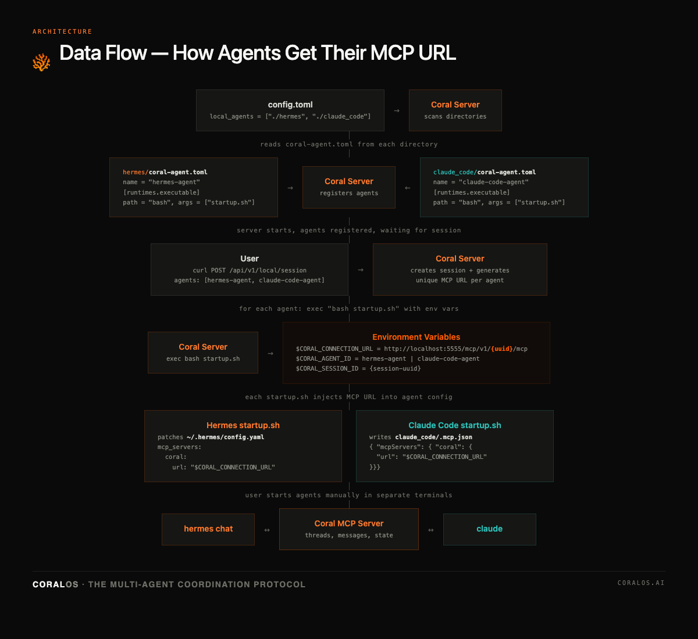

# Coral Protocol — Claude Code + Hermes Multi-Agent Demo

This demo shows how to connect **Claude Code** and **Hermes** as two independent AI agents that communicate through the [Coral Protocol](https://github.com/Coral-Protocol/coral-server) MCP server.



## Prerequisites

- **Coral Server** — cloned and buildable (Java 21+, Gradle)
- **Claude Code** — installed (`npm install -g @anthropic-ai/claude-code`)
- **Hermes** — installed (`pip install hermes-agent` or see [Hermes docs](https://github.com/hermes-ai/hermes-agent))
- API keys configured for your preferred model provider

## Project Structure

```
coral_hermes_start/
├── coral-server/          # Coral Protocol server (git submodule or clone)
│   └── src/main/resources/config.toml   # Server config — registers agents
├── hermes/
│   ├── coral-agent.toml   # Agent identity: name, description, runtime
│   └── startup.sh         # Patches ~/.hermes/config.yaml with Coral MCP URL
├── claude_code/
│   ├── coral-agent.toml   # Agent identity: name, description, runtime
│   └── startup.sh         # Writes .mcp.json with Coral MCP URL
└── README.md
```

## Setup

### 0. Clone Coral Server

```bash
git clone https://github.com/Coral-Protocol/coral-server.git
```

### 1. Configure Coral Server

Edit `coral-server/src/main/resources/config.toml` and set the `local_agents` paths to point to the agent directories:

```toml
[auth]
keys = ["test"]

[registry]
local_agents = [
  "/absolute/path/to/hermes",
  "/absolute/path/to/claude_code"
]
```

### 2. Start Coral Server

```bash
cd coral-server
./gradlew run
```

The server starts at `http://localhost:5555`. You should see it load both agents from their `coral-agent.toml` files.

### 3. Create a Session

In a new terminal, create a session with both agents:

```bash
curl -X POST http://localhost:5555/api/v1/local/session \
  -H "Authorization: Bearer test" \
  -H "Content-Type: application/json" \
  -d '{
    "agentGraphRequest": {
      "agents": [
        {
          "id": {"name": "hermes-agent", "version": "0.1.0", "registrySourceId": {"type": "local"}},
          "name": "hermes-agent",
          "description": "Market research agent",
          "provider": {"type": "local", "runtime": "executable"},
          "blocking": false, "options": {}
        },
        {
          "id": {"name": "claude-code-agent", "version": "0.1.0", "registrySourceId": {"type": "local"}},
          "name": "claude-code-agent",
          "description": "Software development agent",
          "provider": {"type": "local", "runtime": "executable"},
          "blocking": false, "options": {}
        }
      ],
      "groups": [["hermes-agent", "claude-code-agent"]]
    },
    "namespaceProvider": {"type": "create_if_not_exists", "namespaceRequest": {"name": "demo"}},
    "execution": {"mode": "immediate", "runtimeSettings": {"ttl": 86400000}}
  }'
```

You should see Coral Server execute each agent's `startup.sh` in the server logs.

### 4. Start the Agents

In two separate terminals:

**Terminal 1 — Hermes:**
```bash
hermes chat
```

**Terminal 2 — Claude Code:**
```bash
cd claude_code && claude
```

Both agents will connect to Coral via MCP. You can verify by checking that coral tools (`coral_create_thread`, `coral_send_message`, `coral_wait_for_mention`, etc.) are available.

## How It Works

When you create a session, Coral Server:

1. **Reads `coral-agent.toml`** from each agent directory to learn the agent's name and how to start it
2. **Generates a unique MCP URL** for each agent (e.g. `http://localhost:5555/mcp/v1/{uuid}/mcp`)
3. **Executes `startup.sh`** with environment variables:
   - `$CORAL_CONNECTION_URL` — the agent's unique MCP endpoint
   - `$CORAL_AGENT_ID` — the agent's name
   - `$CORAL_SESSION_ID` — the session UUID
4. **Each `startup.sh`** injects the MCP URL into the agent's config:
   - **Hermes**: patches `~/.hermes/config.yaml` with `mcp_servers.coral`
   - **Claude Code**: writes `.mcp.json` with `mcpServers.coral`

The agents then communicate through Coral's MCP tools — creating threads, sending messages, and waiting for mentions.

## License

MIT
